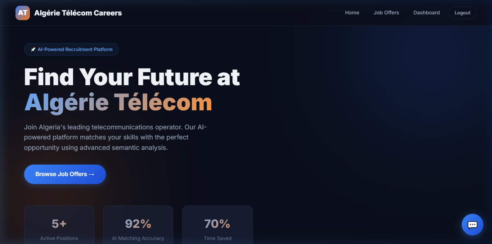
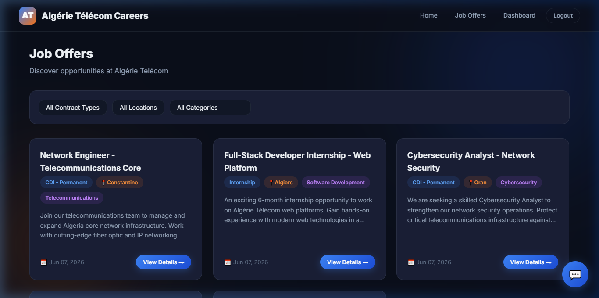
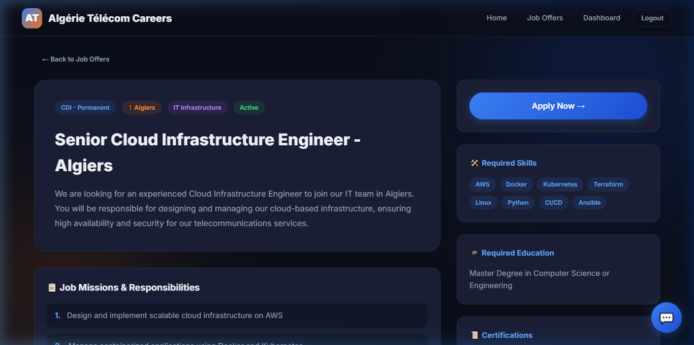
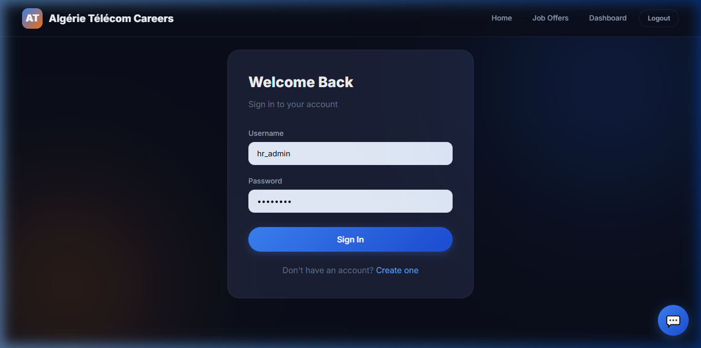
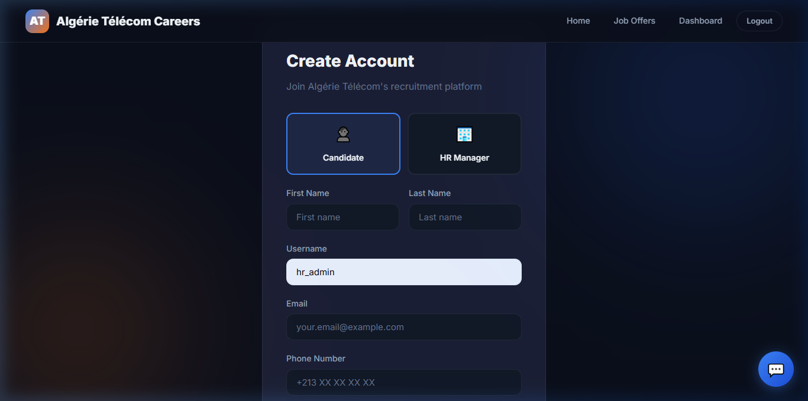
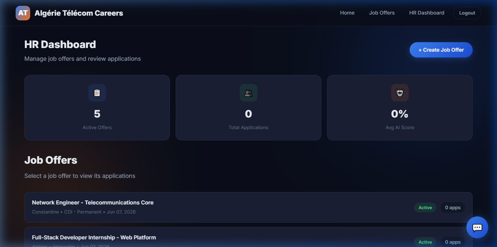
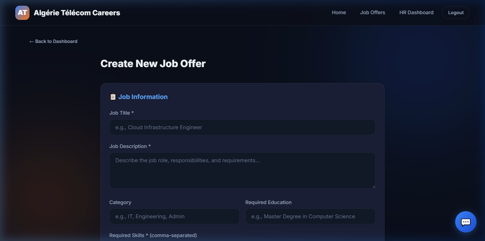
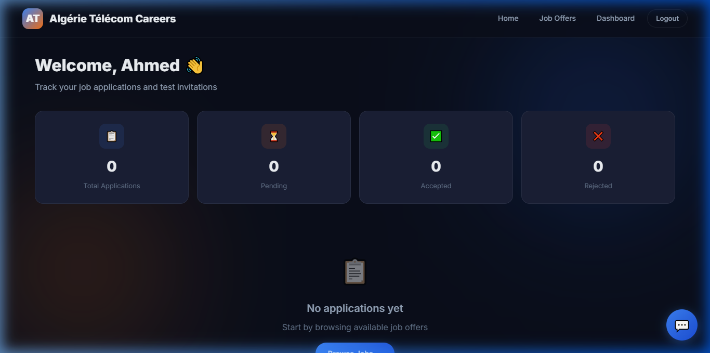

# 🚀 Web-Based Recruitment System with AI-Powered Resume Matching

<div align="center">

**Algérie Télécom - AI Recruitment Platform**

*An intelligent recruitment management and analysis platform powered by AI for semantic CV matching, automated candidate ranking, technical testing, and a RAG-based chatbot assistant.*

[](https://python.org)
[](https://djangoproject.com)
[](https://sqlite.org)
[](https://groq.com)
[]()

</div>

---

## 📋 Table of Contents

- [Overview](#-overview)
- [Features](#-features)
- [AI System Architecture](#-ai-system-architecture)
- [Screenshots](#-screenshots)
- [Tech Stack](#-tech-stack)
- [Project Structure](#-project-structure)
- [Installation](#-installation)
- [Usage](#-usage)
- [API Endpoints](#-api-endpoints)
- [AI Scoring Formula](#-ai-scoring-formula)
- [Chatbot Assistant](#-chatbot-assistant)
- [Testing](#-testing)
- [Authors](#-authors)

---

## 🎯 Overview

This project is a **Web-Based Recruitment System with AI-Powered Resume Matching** developed for **Algérie Télécom**, Algeria's leading telecommunications operator. The platform addresses the limitations of traditional manual recruitment by automating CV analysis, candidate ranking, and providing intelligent assistance.

### Problem Statement

Traditional recruitment at Algérie Télécom faces:
- ⏱️ Time-consuming manual review of hundreds of CVs per offer
- 🎯 Subjective candidate evaluation with no semantic understanding
- 📉 No automated ranking mechanism
- 🔗 Lack of centralized data tracking and workflows

### Our Solution

An AI-powered platform that:
- 🤖 **Semantic CV Matching** using SentenceTransformers and cosine similarity
- 📊 **Dual AI Approach** combining embedding models + LLM (Groq Llama 70B)
- 📝 **Integrated Technical Testing** with automated scoring
- 💬 **RAG-based AI Chatbot** for candidate guidance
- 📈 **Complete Recruitment Workflow Automation** with real-time tracking

---

## ✨ Features

### For Candidates
| Feature | Description |
|---------|-------------|
| 🔐 Account Management | Register, login, and manage profile |
| 📋 Browse Job Offers | Search and filter by contract type, location, and category |
| 📄 Apply with CV Upload | Submit PDF resumes with AI-powered analysis |
| 📊 Dashboard | Real-time application status tracking (Pending → Reviewed → Accepted/Rejected) |
| 📝 Technical Tests | Timed MCQ tests with automatic scoring |
| 💬 AI Chatbot | 24/7 intelligent assistant for recruitment queries |

### For HR Managers
| Feature | Description |
|---------|-------------|
| ➕ Create Job Offers | Publish offers with skills, education, certifications, and missions |
| 📊 AI Ranking Dashboard | View candidates ranked by AI matching score |
| 🔍 Detailed AI Analysis | Score breakdown (Profile, Semantic, Mission, Category, Quality) |
| 📝 Send Technical Tests | Assign tests to eligible candidates (AI score ≥ 50%) |
| ✅ Status Management | Accept/reject candidates with one click |
| 🤖 AI Summaries | Auto-generated candidate assessment summaries |

### AI System
| Feature | Description |
|---------|-------------|
| 🧠 Approach 1 | SentenceTransformer (all-MiniLM-L6-v2) + Cosine Similarity + Weighted Scoring |
| 🤖 Approach 2 | Groq API (Llama 3.3 70B) + RAG for enhanced LLM analysis |
| 📊 Combined Score | Averages both approaches for robustness |
| 💬 RAG Chatbot | Groq + database-retrieved context for accurate responses |

---

## 🧠 AI System Architecture

### AI-Powered Job Resume Matching Pipeline

```
┌──────────────┐     ┌───────────────────┐     ┌──────────────────┐
│  Input Data  │────▶│ Text Extraction & │────▶│    Embedding     │
│  (CV + Job)  │     │  Preprocessing    │     │   Generation     │
└──────────────┘     └───────────────────┘     │ (MiniLM-L6-v2)  │
                                                └────────┬─────────┘
                                                         │
                     ┌───────────────────┐               │
                     │  Groq LLM (Llama  │◀──────────────┤
                     │  70B) + RAG       │               │
                     │  (Approach 2)     │               ▼
                     └────────┬──────────┘     ┌──────────────────┐
                              │                │ Matching & Feature│
                              │                │   Extraction     │
                              │                │  (Approach 1)    │
                              ▼                └────────┬─────────┘
                     ┌───────────────────┐              │
                     │  Combined Score   │◀─────────────┘
                     │  & AI Summary     │
                     └────────┬──────────┘
                              │
                              ▼
                     ┌───────────────────┐
                     │ Output & Storage  │
                     │ (Django Database) │
                     └───────────────────┘
```

### Approach 1: Embedding Model

Uses **SentenceTransformer (all-MiniLM-L6-v2)** to:
1. Convert job descriptions and resumes into semantic vector embeddings
2. Compute cosine similarity between vectors
3. Extract features (skills, education, certifications, missions)
4. Apply weighted scoring formula

### Approach 2: Groq + RAG (Llama 70B)

Uses **Groq API with Llama 3.3 70B Versatile** to:
1. Build RAG context from job offer database (skills, missions, requirements)
2. Send resume + job context to LLM for deep analysis
3. Extract strengths, weaknesses, and overall assessment
4. Generate human-readable AI summaries

---

## 📸 Screenshots

### 🏠 Home Page (Landing Page)


### 📋 Job Offers List


### 📄 Job Offer Detail


### 🔐 Login Page


### 📝 Registration Page


### 📊 HR Manager Dashboard


### ➕ Create Job Offer Form


### 👤 Candidate Dashboard


---

## 🛠️ Tech Stack

| Layer | Technology |
|-------|-----------|
| **Backend** | Python 3.10+, Django 6.0 |
| **Database** | SQLite |
| **Frontend** | HTML5, CSS3, JavaScript |
| **AI/NLP** | SentenceTransformers (all-MiniLM-L6-v2) |
| **LLM** | Groq API - Llama 3.3 70B Versatile |
| **PDF Processing** | pdfplumber |
| **ML Libraries** | scikit-learn, NumPy |
| **API** | Django REST Framework |
| **Authentication** | Django Sessions + SimpleJWT |
| **CORS** | django-cors-headers |

---

## 📁 Project Structure

```
rankingIMPROVED/
├── manage.py                       # Django management script
├── seed_data.py                    # Database seeding script
├── db.sqlite3                      # SQLite database
├── requirements.txt                # Python dependencies
├── README.md                       # This file
│
├── recruitment_project/            # Django project settings
│   ├── settings.py                 # Configuration (DB, apps, API keys)
│   ├── urls.py                     # Root URL configuration
│   ├── wsgi.py                     # WSGI entry point
│   └── asgi.py                     # ASGI entry point
│
├── recruitment/                    # Main Django application
│   ├── models.py                   # Data models (Job, Application, Test, etc.)
│   ├── views.py                    # View functions (auth, offers, dashboard, etc.)
│   ├── urls.py                     # App URL routing
│   ├── admin.py                    # Django admin configuration
│   ├── ai_matching.py              # AI Resume Matching Engine (Approach 1 + 2)
│   ├── chatbot.py                  # RAG-based AI Chatbot (Groq + Llama 70B)
│   ├── apps.py                     # App configuration
│   ├── templatetags/
│   │   └── custom_filters.py       # Custom template filters (split, score_class)
│   └── migrations/                 # Database migrations
│
├── templates/                      # HTML templates
│   ├── base.html                   # Base layout (navbar, chatbot, footer)
│   ├── home.html                   # Landing page
│   ├── login.html                  # Login form
│   ├── register.html               # Registration form (Candidate/HR)
│   ├── job_offers.html             # Job offers list with filters
│   ├── job_offer_detail.html       # Job offer detail with sidebar
│   ├── apply.html                  # Application form with CV upload
│   ├── candidate_dashboard.html    # Candidate application tracking
│   ├── hr_dashboard.html           # HR manager overview
│   ├── hr_create_offer.html        # Create job offer + technical test
│   ├── hr_application_detail.html  # AI analysis detail view
│   ├── take_test.html              # MCQ technical test with timer
│   └── test_result.html            # Test results page
│
├── static/
│   └── css/
│       └── style.css               # Complete design system (dark theme)
│
├── media/
│   └── cvs/                        # Uploaded CV files
│
└── screenshots/                    # Application screenshots
    ├── home_page.png
    ├── job_offers.png
    ├── job_detail.png
    ├── login.png
    ├── register.png
    ├── hr_dashboard.png
    ├── create_offer.png
    └── candidate_dashboard.png
```

---

## 🚀 Installation

### Prerequisites

- Python 3.10 or higher
- pip (Python package manager)
- Git

### Step 1: Clone the Repository

```bash
git clone https://github.com/amnamine/AiRankingSystem.git
cd AiRankingSystem
```

### Step 2: Install Dependencies

```bash
pip install django djangorestframework djangorestframework-simplejwt django-cors-headers
pip install sentence-transformers scikit-learn numpy
pip install pdfplumber PyPDF2
pip install groq
```

### Step 3: Run Database Migrations

```bash
python manage.py makemigrations recruitment
python manage.py migrate
```

### Step 4: Seed the Database (Optional)

```bash
python seed_data.py
```

This creates:
- **HR Manager** account: `hr_admin` / `hr123456`
- **Candidate** accounts: `candidate1`, `candidate2`, `candidate3` / `test1234`
- **Admin** superuser: `admin` / `admin123`
- **5 Job Offers** across IT, Data Science, Cybersecurity, Web Dev, and Telecom
- **3 Technical Tests** with MCQ questions

### Step 5: Start the Development Server

```bash
python manage.py runserver
```

Visit: **http://127.0.0.1:8000/**

---

## 📖 Usage

### Candidate Workflow

1. **Create Account** → Register as a Candidate
2. **Browse Jobs** → View available job offers with filters
3. **Apply** → Upload your CV (PDF) to a job offer
4. **AI Analysis** → Your CV is automatically analyzed by the AI system
5. **Track Status** → Monitor your application in the dashboard
6. **Take Test** → Complete technical tests if invited by HR
7. **Get Chatbot Help** → Click the 💬 icon for instant assistance

### HR Manager Workflow

1. **Create Account** → Register as an HR Manager
2. **Create Job Offer** → Add job details, required skills, missions, and optional technical test
3. **Review Applications** → View AI-ranked candidates sorted by matching score
4. **Detailed Analysis** → See score breakdown (Profile, Semantic, Mission, Category, Quality)
5. **Send Tests** → Assign technical tests to eligible candidates (score ≥ 50%)
6. **Manage Status** → Accept or reject candidates

---

## 🔌 API Endpoints

| Method | Endpoint | Description |
|--------|----------|-------------|
| `GET` | `/` | Home page |
| `GET/POST` | `/login/` | User login |
| `GET/POST` | `/register/` | User registration |
| `GET` | `/logout/` | User logout |
| `GET` | `/offers/` | Job offers list (with filters) |
| `GET` | `/offers/<id>/` | Job offer detail |
| `GET/POST` | `/apply/<id>/` | Submit application with CV |
| `GET` | `/dashboard/` | Candidate dashboard |
| `GET/POST` | `/test/<id>/` | Take technical test |
| `GET` | `/hr/` | HR dashboard |
| `GET/POST` | `/hr/create-offer/` | Create new job offer |
| `GET` | `/hr/application/<id>/` | Application detail with AI analysis |
| `POST` | `/hr/send-test/<id>/` | Send technical test to candidate |
| `POST` | `/hr/update-status/<id>/` | Update application status |
| `POST` | `/api/chatbot/` | Chatbot API (JSON) |

---

## 📊 AI Scoring Formula

The AI scoring engine implements a **weighted multi-criteria formula** as defined in the thesis:

```
FinalScore = (0.35 × Profile) + (0.30 × Semantic) + (0.20 × Mission) + (0.10 × Category) + (0.05 × Quality)
```

### Score Components

| Component | Weight | Description |
|-----------|--------|-------------|
| **Profile Score** | 35% | `0.50 × Education + 0.35 × Skills + 0.15 × Certifications` |
| **Semantic Similarity** | 30% | Cosine similarity between resume and job description embeddings |
| **Mission Relevance** | 20% | Semantic match between resume and job missions/responsibilities |
| **Category Match** | 10% | Professional domain alignment check |
| **Resume Quality** | 5% | Structure completeness (education, experience, skills, contact sections) |

### Profile Score Breakdown

```
ProfileScore = (0.50 × EducationScore) + (0.35 × SkillsScore) + (0.15 × CertificationScore)
```

Where:
- **SkillsScore** = (Matched Skills / Total Required Skills) × 100
- **EducationScore** = Semantic match of education requirements
- **CertificationScore** = (Matched Certifications / Required Certifications) × 100

---

## 💬 Chatbot Assistant

The platform includes an AI chatbot named **"Recruitment Assistant - Algérie Télécom Carrières"**:

- **Technology**: Groq API + Llama 3.3 70B + RAG
- **RAG Context**: Retrieves active job offers and platform info from the database
- **Capabilities**:
  - Job offer information and recommendations
  - Application process guidance
  - Required documents and qualifications
  - Location-based job search
  - Response time expectations
  - Bilingual support (French/English)

### Chatbot Architecture

```
User Query → RAG Context Retrieval (DB) → Groq LLM (Llama 70B) → Response
                    ↑
            Active Job Offers
            Platform Information
            Application Process Details
```

---

## 🧪 Testing

### Running the Application

```bash
python manage.py runserver
```

### Test Accounts (after seeding)

| Role | Username | Password |
|------|----------|----------|
| HR Manager | `hr_admin` | `hr123456` |
| Candidate | `candidate1` | `test1234` |
| Candidate | `candidate2` | `test1234` |
| Candidate | `candidate3` | `test1234` |
| Admin | `admin` | `admin123` |

### Testing the AI System

1. Login as a **candidate**
2. Apply to a job offer with a **PDF CV**
3. The AI will:
   - Extract text from the PDF
   - Run **Approach 1** (SentenceTransformer embedding analysis)
   - Run **Approach 2** (Groq LLM + RAG analysis)
   - Combine scores and generate summary
4. Login as **HR manager** to view the ranked candidates and detailed AI analysis

### Validation Results (from thesis)

- **AI Matching Accuracy**: 92% correlation with human expert ranking
- **Time Saved**: ~70% reduction in CV pre-screening time
- **Expert Feedback**: Platform confirmed ready for operational use

---

## 📊 Data Models

```
User (Django Auth)
  └── UserProfile (role: candidate/hr)

Job
  ├── title, description, required_skills, required_education
  ├── required_certifications, category
  └── JobMission[] (responsibilities)

JobOffer
  ├── job (FK), title, description, location, contract_type
  ├── status, published_date, deadline, searched_profiles
  └── TechnicalTest (optional)
       └── TestQuestion[] (MCQ: A/B/C/D)

Application
  ├── candidate (FK), job_offer (FK), cv_file, status
  ├── AI Scores: ai_score, profile, semantic, mission, category, quality
  ├── ai_summary, ai_matched_skills, ai_strengths, ai_weaknesses
  └── TestAssignment (optional)
       └── TestAnswer[] (selected answers)

ChatMessage
  └── user, message, response, created_at
```

---

## 👥 Authors

| Name | Specialty |
|------|-----------|
| **Amara Soumia** | Information Systems and Software Engineering (ISIL) |
| **Boussaha Rania** | Information Systems and Software Engineering (ISIL) |
| **Bentouta Nour El Houda** | Computer Systems (SIQ) |

**Supervisor**: Pr. Fareh

**University**: Blida 1 University - Faculty of Sciences - Department of Computer Science

**Academic Year**: 2025 / 2026

---

## 📄 License

This project was developed as a **Bachelor's Report** in Computer Science at Blida 1 University. It is intended for academic purposes.

---

<div align="center">

**Built with ❤️ for Algérie Télécom**

*Powered by SentenceTransformers, Groq Llama 70B, and Django*

</div>
